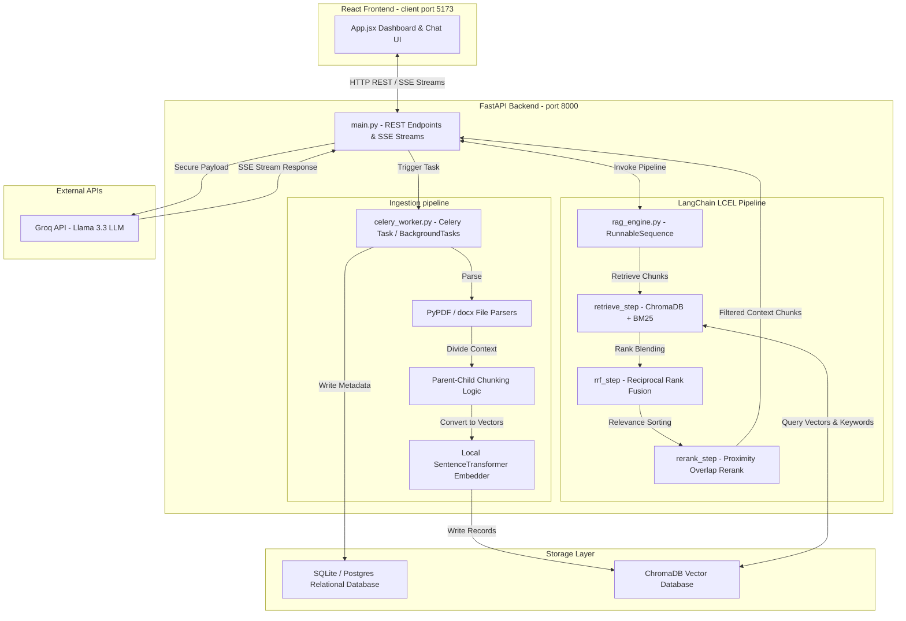

# DocMind AI - Technical Q&A & Interview Guide

This document provides detailed answers to architectural, conceptual, and model-specific questions regarding the **DocMind AI** platform.

---

## 1. Overall Architecture

### Is this project a traditional RAG, Hybrid RAG, Agentic RAG, or Multi-Agent RAG? Why?
This project is a **Hybrid RAG** platform.
*   **Why it is Hybrid**: It executes dual-path retrieval—combining **Dense semantic retrieval** (using vector embeddings in ChromaDB) and **Sparse lexical retrieval** (using BM25 keyword matching) to query documents.
*   **Why it is NOT Agentic or Multi-Agent**: The workflow is fully deterministic and linear. It does not use LLM reasoning to decide which tools to run, branch code execution, or loop based on evaluation criteria. It follows a fixed code-driven path to fetch, rank, rerank, and synthesize text.

### Complete Architecture Diagram



### End-to-End Request Flow
1.  **User Input**: The user selects documents in the React sidebar and submits a query in the chat input.
2.  **API Call**: The React frontend sends a `POST` request to `/api/chat/query` containing the active `session_id`, `query`, and the list of checked `doc_ids_str`.
3.  **Pipeline Activation**: The backend saves the user's message, compiles the query constraints, and calls `run_rag_pipeline(query, doc_ids)` which invokes the compiled LangChain LCEL `RunnableSequence` pipeline.
4.  **Retrieval Node**:
    *   **Dense Path**: Generates a query vector embedding and searches ChromaDB for the top 10 closest child vectors matching the document filters.
    *   **Sparse Path**: Retrieves all candidate chunks for the target documents and runs a `BM25Okapi` query to rank keyword matches.
5.  **RRF Fusion Node**: Takes the dense and sparse candidate lists, computes their reciprocal rank fusion score ($1 / (\text{rank} + 60)$), and merges them into a top 8 list.
6.  **Rerank Node**: Performs token-proximity and Jaccard-overlap similarity checks to re-sort the candidates. It picks the top 3 best matching parent-context chunks.
7.  **Inference call**: The backend inserts the top 3 parent chunks into the system prompt context and opens an HTTPS connection to Groq.
8.  **Streaming Response**: Groq streams tokens using `llama-3.3-70b-versatile` over a Server-Sent Events (SSE) `StreamingResponse`. The frontend parses these streams line-by-line, updating the chat bubble in real-time, and saves the completed text to the SQLite/PostgreSQL database.

---

## 2. Agentic Questions

### Does my project contain AI agents?
**No**, the project does not contain autonomous AI agents. The LLM (Llama 3.3) is used solely as a synthesis engine to compile a structured answer from pre-sorted context. It is not acting as an agent that selects tools, plans task sequences, or reasons about execution paths.

### If yes, how many agents are there?
There are **0** active autonomous agents.

### What are the responsibilities of each agent?
*Not applicable, as there are no agents.*

### Which component acts as the planner or manager agent?
There is no planner or manager agent. The system's execution pipeline is managed by deterministic Python code.

### Which component makes autonomous decisions?
None. The code executes a fixed, sequential path from top to bottom.

### Where does the system decide what action to take next?
The execution sequence is hardcoded. There are no conditional routing rules or LLM-driven path selections. 

### Does my system dynamically choose tools or follow a fixed workflow?
It follows a **fixed workflow** (`retrieve` $\rightarrow$ `rrf` $\rightarrow$ `rerank` $\rightarrow$ `END`).

### If my workflow is fixed, why isn't it considered Agentic RAG?
Agentic RAG requires an LLM to evaluate the incoming query, dynamically choose which tools to execute (such as deciding whether to query the vector store, search the web, execute a python sandbox, or calculate mathematical properties), verify if the returned results are sufficient, and repeat or reformulate query boundaries if they are not. Because this project follows a deterministic, code-defined pipeline, it is classified as **Orchestrated Hybrid RAG**, not Agentic RAG.

---

## 3. LangChain Questions

### How is LangChain used in my project?
LangChain is used in `backend/rag_engine.py` via its **LCEL (LangChain Expression Language)** subsystem. The pipeline is built using `RunnableLambda` wrappers piped together into a `RunnableSequence`. A shared state dictionary (`RagState`) is passed through each step, and each step function merges its partial output back into the state. This provides a clean interface to track and log execution steps, which feeds directly into the visual **RAG Analyzer** sandbox.

### Is LangChain only orchestrating a workflow or coordinating multiple AI agents?
It is **only orchestrating a workflow** (a sequential processing pipeline). It is not coordinating multiple AI agents.

### Show all LangChain pipeline steps
The pipeline contains three steps:
1.  `retrieve_step` (wraps `retrieve_node`): Runs dense vector similarities and sparse keyword scores.
2.  `rrf_step` (wraps `rrf_node`): Blends dense and sparse rankings using Reciprocal Rank Fusion.
3.  `rerank_step` (wraps `rerank_node`): Refines ranks using query proximity-overlap metrics.

### Which LangChain steps represent agents?
**None**. All three steps are deterministic, code-driven processing functions.

### Which steps are just processing steps?
**All steps** (`retrieve_step`, `rrf_step`, and `rerank_step`) are processing steps.

### Is there a supervisor node?
**No**.

### Is there a planner node?
**No**.

### Does any step call another step dynamically?
**No**. Step transitions are linear and hardcoded:
```python
rag_chain = (
    RunnableLambda(retrieve_step)
    | RunnableLambda(rrf_step)
    | RunnableLambda(rerank_step)
)
```

---

## 4. Multi-Agent Questions

### Is this a single-agent or multi-agent system?
It is a **single-pipeline system**. It does not use multiple independent AI agents.

### What makes it single-agent or multi-agent?
A multi-agent system consists of two or more independent LLM loops (agents) configured with unique system prompts and tools that pass messages or interact to solve a task. Since this system consists of a single linear pipeline feeding a single LLM synthesis task, it is not multi-agent.

### Which agents communicate with each other?
*Not applicable.*

### How do agents share information?
There are no agents. Information is shared between python processing steps using a unified state dictionary (`RagState`) passed through the LangChain LCEL `RunnableSequence` pipeline.

### Is there a leader (supervisor) agent?
**No**.

### Is this a hierarchical or peer-to-peer multi-agent architecture?
*Not applicable.*

---

## 5. RAG Questions

### Explain my complete RAG pipeline
1.  **Ingestion**: Files are parsed. Plain text splits at 1,500 characters. PDFs split by pages.
2.  **Parent-Child Chunking**: Parent chunks (1500 chars) are split into smaller child chunks (400 chars).
3.  **Embeddings**: Child chunks are converted to vector embeddings using `BAAI/bge-base-en-v1.5`.
4.  **Indexing**: Vectors are indexed in ChromaDB. SQL metadata tracks document parameters.
5.  **Retrieval**: Concurrently runs vector semantic search and BM25 lexical keyword searches.
6.  **Fusion (RRF)**: Blends dense and sparse search rankings.
7.  **Reranking**: Scores chunks using query token proximity/overlap.
8.  **Generation**: Streams responses from Groq Llama 3.3 using the top reranked parent texts as context.

### Where does retrieval happen?
Retrieval happens in `retrieve_node` inside [backend/rag_engine.py](file:///d:/projects_2/Project_v/backend/rag_engine.py#L40-L135).

### Where does RRF happen?
Reciprocal Rank Fusion happens in `rrf_node` inside [backend/rag_engine.py](file:///d:/projects_2/Project_v/backend/rag_engine.py#L136-L196).

### Where does reranking happen?
Reranking happens in `rerank_node` inside [backend/rag_engine.py](file:///d:/projects_2/Project_v/backend/rag_engine.py#L197-L244).

### Where does the Cross Encoder rerank?
The cross-encoder-like reranking is performed programmatically inside the `rerank_node` using token Jaccard-overlap similarity metrics.

### Where are embeddings created?
*   **During Ingestion**: In the Celery task `ingest_document_task` in [backend/celery_worker.py](file:///d:/projects_2/Project_v/backend/celery_worker.py#L205-L208).
*   **During Querying**: In `retrieve_node` in [backend/rag_engine.py](file:///d:/projects_2/Project_v/backend/rag_engine.py#L58-L60).
Both utilize `LocalEmbeddingGenerator` which runs `SentenceTransformer('BAAI/bge-base-en-v1.5')`.

### Where are vectors stored?
Vectors are persisted locally in the directory `backend/chroma_db/` using ChromaDB's persistent disk client.

### How does Parent–Child Chunking work in my implementation?
1.  **Ingestion Division**: The system divides document text into large **Parent** text blocks (1500 chars, 200 overlap).
2.  **Child Generation**: Each parent is split into smaller **Child** text blocks (400 chars, 50 overlap).
3.  **Indexing**: The child chunks are vectorized and added to ChromaDB. Their metadata dictionary stores a reference to the `parent_text` and `document_id`.
4.  **Query & Extraction**: ChromaDB searches for matching small child chunks (which is highly precise). However, when returning search results, the system discards the child text and retrieves the `parent_text` from metadata to pass to the LLM. This provides the LLM with complete paragraph contexts rather than fragmented sentences.

---

## 6. Decision-Making Questions

### Does the system ever decide to retrieve again?
**No**. Retrieval is performed exactly once per query.

### Can it choose between BM25 and Dense Retrieval?
**No**. It executes both methods concurrently and fuses the results.

### Can it decide to summarize only when necessary?
**No**. The chat queries always go through the retrieval pipeline, while document summaries are requested explicitly via the **Study Hub** buttons.

### Can it search the web automatically?
**No**. The retrieval is restricted to local uploaded document contexts.

### Can it ask the user for clarification?
**No**. The LLM generates a response based on whatever context it receives; it cannot halt execution to prompt the user.

### Can it retry if retrieval quality is poor?
**No**. The system has no self-evaluation or retry loops.

### Does it evaluate whether enough information has been retrieved?
**No**. The system selects the top 3 reranked chunks and passes them to the LLM regardless of their similarity scores.

### Verdict
Because the answers to these decision-making questions are **No**, this platform is **not agentic**. It is a structured, deterministic Hybrid RAG pipeline.

---

## 7. Framework Questions

### Which frameworks are used?
*   **Frontend**: React (Vite, SPA, state hooks).
*   **Backend**: FastAPI (Python ASGI framework).

### Which AI framework is used?
*   `SentenceTransformers` (for local embedding generation).
*   `Rank-BM25` (for lexical search scoring).
*   `Groq SDK` (for LLM interaction).

### Which orchestration framework is used?
`LangChain LCEL` (LangChain Expression Language — used for `RunnableSequence` pipeline composition, state management, and step-by-step tracing).

### Why was LangChain chosen?
LangChain was chosen because:
1.  **LCEL Composability**: LangChain's Expression Language (`RunnableLambda`, `RunnableSequence`) provides a clean, pipe-based API to compose sequential processing steps. Each step receives and returns a state dictionary, making the flow easy to read, test, and extend.
2.  **Ecosystem Integration**: LangChain's ecosystem includes `langchain-groq`, `langchain-community`, and extensive tooling for embeddings, retrievers, and chat models, making future enhancements (e.g., switching LLM providers, adding memory modules) straightforward without restructuring the codebase.

---

## 8. Protocol Questions

### Which communication protocols are used?
*   **HTTP/1.1**: Underlies all REST and streaming APIs.
*   **REST (Representational State Transfer)**: Standard API routes are used for CRUD actions (e.g. `GET /api/documents` to list files, `DELETE /api/documents/{id}` to delete files).
*   **Server-Sent Events (SSE)**: Used for streaming LLM responses. The backend uses FastAPI's `StreamingResponse(media_type="text/event-stream")` to yield tokens, and the React frontend uses a `ReadableStream` reader to update chat bubbles in real-time.
*   **WebSockets**: Not used.
*   **MCP / ACP / A2A**: Not used.

---

## 9. Models

### Which LLM is used?
**`llama-3.3-70b-versatile`** (accessed via Groq API).

### Which embedding model is used?
**`BAAI/bge-base-en-v1.5`** (loaded locally via HuggingFace SentenceTransformers).

### Which reranking model is used?
There is no separate external reranker model (such as Cohere or BAAI/bge-reranker). Instead, the system uses a **custom programmatic token-proximity Jaccard similarity scoring function** in Python to rerank candidates inside the `rerank_node`.

### Which models perform reasoning?
`llama-3.3-70b-versatile` (handles synthesis, reasoning, and document outline extraction).

### Which models perform retrieval?
*   `BAAI/bge-base-en-v1.5` (handles dense vector semantic retrieval in ChromaDB).
*   `BM25Okapi` (handles sparse keyword retrieval in Python).
